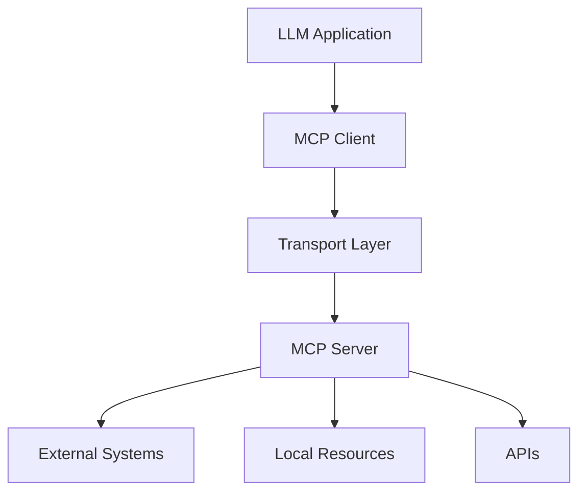

# MCP Protocol Specification

This document defines the authoritative protocol requirements for the Model Context Protocol (MCP), based on the TypeScript schema in the official specification.

## Overview

[Model Context Protocol](https://modelcontextprotocol.io) (MCP) is an open protocol that enables seamless integration between LLM applications and external data sources and tools. Whether you're building an AI-powered IDE, enhancing a chat interface, or creating custom AI workflows, MCP provides a standardized way to connect LLMs with the context they need.

The key words "MUST", "MUST NOT", "REQUIRED", "SHALL", "SHALL NOT", "SHOULD", "SHOULD NOT", "RECOMMENDED", "NOT RECOMMENDED", "MAY", and "OPTIONAL" in this document are to be interpreted as described in [BCP 14](https://datatracker.ietf.org/doc/html/bcp14).

## Architecture

MCP follows a client-server architecture where:

- **Clients** are applications that want to access resources, tools, or prompts
- **Servers** provide these capabilities and can be local or remote
- **Transport layers** handle communication between clients and servers



### Client-Server Model

The protocol operates on a request-response model where:

1. Clients discover server capabilities through initialization
2. Clients request operations (tools, resources, prompts)
3. Servers respond with results or errors
4. Servers can send notifications for updates

### Message Format

All MCP messages follow JSON-RPC 2.0 format:

```json
{
  "jsonrpc": "2.0",
  "id": 1,
  "method": "method_name",
  "params": {
    "parameter": "value"
  }
}
```

## Lifecycle

### Initialization

The protocol begins with an initialization handshake:

**Client Request:**
```json
{
  "jsonrpc": "2.0",
  "id": 1,
  "method": "initialize",
  "params": {
    "protocolVersion": "2024-11-05",
    "capabilities": {
      "roots": {
        "listChanged": true
      },
      "sampling": {}
    },
    "clientInfo": {
      "name": "example-client",
      "version": "1.0.0"
    }
  }
}
```

**Server Response:**
```json
{
  "jsonrpc": "2.0",
  "id": 1,
  "result": {
    "protocolVersion": "2024-11-05",
    "capabilities": {
      "logging": {},
      "prompts": {
        "listChanged": true
      },
      "resources": {
        "subscribe": true,
        "listChanged": true
      },
      "tools": {
        "listChanged": true
      }
    },
    "serverInfo": {
      "name": "example-server",
      "version": "1.0.0"
    }
  }
}
```

### Initialization Complete

After successful initialization, the client sends:

```json
{
  "jsonrpc": "2.0",
  "method": "notifications/initialized"
}
```

## Messages

### Core Protocol Messages

#### Ping

For connection health checks:

**Request:**
```json
{
  "jsonrpc": "2.0",
  "id": 1,
  "method": "ping"
}
```

**Response:**
```json
{
  "jsonrpc": "2.0",
  "id": 1,
  "result": {}
}
```

#### Progress

For long-running operations:

**Progress Notification:**
```json
{
  "jsonrpc": "2.0",
  "method": "notifications/progress",
  "params": {
    "progressToken": "token123",
    "progress": 50,
    "total": 100
  }
}
```

#### Cancellation

To cancel ongoing requests:

**Cancellation Request:**
```json
{
  "jsonrpc": "2.0",
  "method": "notifications/cancelled",
  "params": {
    "requestId": 123,
    "reason": "User cancelled operation"
  }
}
```

### Tools

#### List Tools

**Request:**
```json
{
  "jsonrpc": "2.0",
  "id": 1,
  "method": "tools/list"
}
```

**Response:**
```json
{
  "jsonrpc": "2.0",
  "id": 1,
  "result": {
    "tools": [
      {
        "name": "get_weather",
        "description": "Get current weather for a location",
        "inputSchema": {
          "type": "object",
          "properties": {
            "location": {
              "type": "string",
              "description": "City name"
            }
          },
          "required": ["location"]
        }
      }
    ]
  }
}
```

#### Call Tool

**Request:**
```json
{
  "jsonrpc": "2.0",
  "id": 2,
  "method": "tools/call",
  "params": {
    "name": "get_weather",
    "arguments": {
      "location": "San Francisco"
    }
  }
}
```

**Response:**
```json
{
  "jsonrpc": "2.0",
  "id": 2,
  "result": {
    "content": [
      {
        "type": "text",
        "text": "Current weather in San Francisco: 72°F, sunny"
      }
    ]
  }
}
```

### Resources

#### List Resources

**Request:**
```json
{
  "jsonrpc": "2.0",
  "id": 1,
  "method": "resources/list",
  "params": {
    "cursor": "optional-cursor"
  }
}
```

**Response:**
```json
{
  "jsonrpc": "2.0",
  "id": 1,
  "result": {
    "resources": [
      {
        "uri": "file:///path/to/file.txt",
        "name": "Important Document",
        "description": "A document containing important information",
        "mimeType": "text/plain"
      }
    ],
    "nextCursor": "next-page-cursor"
  }
}
```

#### Read Resource

**Request:**
```json
{
  "jsonrpc": "2.0",
  "id": 2,
  "method": "resources/read",
  "params": {
    "uri": "file:///path/to/file.txt"
  }
}
```

**Response:**
```json
{
  "jsonrpc": "2.0",
  "id": 2,
  "result": {
    "contents": [
      {
        "uri": "file:///path/to/file.txt",
        "mimeType": "text/plain",
        "text": "File contents here..."
      }
    ]
  }
}
```

#### Resource Templates

**Request:**
```json
{
  "jsonrpc": "2.0",
  "id": 3,
  "method": "resources/templates/list"
}
```

**Response:**
```json
{
  "jsonrpc": "2.0",
  "id": 3,
  "result": {
    "resourceTemplates": [
      {
        "uriTemplate": "file:///{path}",
        "name": "File System",
        "description": "Access to file system",
        "mimeType": "text/plain"
      }
    ]
  }
}
```

#### Resource Subscriptions

**Subscribe Request:**
```json
{
  "jsonrpc": "2.0",
  "id": 4,
  "method": "resources/subscribe",
  "params": {
    "uri": "file:///path/to/file.txt"
  }
}
```

**Update Notification:**
```json
{
  "jsonrpc": "2.0",
  "method": "notifications/resources/updated",
  "params": {
    "uri": "file:///path/to/file.txt"
  }
}
```

### Prompts

#### List Prompts

**Request:**
```json
{
  "jsonrpc": "2.0",
  "id": 1,
  "method": "prompts/list"
}
```

**Response:**
```json
{
  "jsonrpc": "2.0",
  "id": 1,
  "result": {
    "prompts": [
      {
        "name": "summarize_code",
        "description": "Create a summary of code changes",
        "arguments": [
          {
            "name": "language",
            "description": "Programming language",
            "required": false
          }
        ]
      }
    ]
  }
}
```

#### Get Prompt

**Request:**
```json
{
  "jsonrpc": "2.0",
  "id": 2,
  "method": "prompts/get",
  "params": {
    "name": "summarize_code",
    "arguments": {
      "language": "python"
    }
  }
}
```

**Response:**
```json
{
  "jsonrpc": "2.0",
  "id": 2,
  "result": {
    "description": "Summarize the provided Python code",
    "messages": [
      {
        "role": "user",
        "content": {
          "type": "text",
          "text": "Please summarize this Python code..."
        }
      }
    ]
  }
}
```

### Sampling

#### Create Message

**Request:**
```json
{
  "jsonrpc": "2.0",
  "id": 1,
  "method": "sampling/createMessage",
  "params": {
    "messages": [
      {
        "role": "user",
        "content": {
          "type": "text",
          "text": "What is 2+2?"
        }
      }
    ],
    "modelPreferences": {
      "hints": [{"name": "claude-3-sonnet"}],
      "intelligencePriority": 0.8,
      "speedPriority": 0.5
    },
    "systemPrompt": "You are a helpful math tutor",
    "maxTokens": 100
  }
}
```

**Response:**
```json
{
  "jsonrpc": "2.0",
  "id": 1,
  "result": {
    "role": "assistant",
    "content": {
      "type": "text",
      "text": "2 + 2 = 4"
    },
    "model": "claude-3-sonnet-20241022",
    "stopReason": "endTurn"
  }
}
```

### Roots

#### List Roots

**Request:**
```json
{
  "jsonrpc": "2.0",
  "id": 1,
  "method": "roots/list"
}
```

**Response:**
```json
{
  "jsonrpc": "2.0",
  "id": 1,
  "result": {
    "roots": [
      {
        "uri": "file:///approved/directory",
        "name": "Project Files"
      }
    ]
  }
}
```

## Transports

### Standard Input/Output (stdio)

Communication over process stdin/stdout:

- Messages are newline-delimited JSON
- Each line contains one complete JSON-RPC message
- UTF-8 encoding is required

Example:
```bash
echo '{"jsonrpc":"2.0","id":1,"method":"ping"}' | your-server
```

### Server-Sent Events (SSE)

HTTP-based transport using SSE:

#### Endpoint Structure

- **POST `/sse`** - Initialize SSE session
- **POST `/message`** - Send messages
- **GET `/sse`** - Receive SSE stream

#### SSE Message Format

```
event: message
data: {"jsonrpc":"2.0","id":1,"method":"ping"}

```

### WebSocket

Real-time bidirectional communication:

- Messages are JSON-RPC formatted
- Both client and server can send messages at any time
- Connection is persistent until explicitly closed

## Data Types

### Content Types

#### Text Content
```json
{
  "type": "text",
  "text": "Plain text content"
}
```

#### Image Content
```json
{
  "type": "image",
  "data": "base64-encoded-image-data",
  "mimeType": "image/jpeg"
}
```

#### Resource Content
```json
{
  "type": "resource",
  "resource": {
    "uri": "file:///path/to/resource",
    "text": "Resource content",
    "mimeType": "text/plain"
  }
}
```

### Error Handling

Errors follow JSON-RPC 2.0 error format:

```json
{
  "jsonrpc": "2.0",
  "id": 1,
  "error": {
    "code": -32602,
    "message": "Invalid params",
    "data": {
      "parameter": "location",
      "error": "Required parameter missing"
    }
  }
}
```

#### Standard Error Codes

- `-32700`: Parse error
- `-32600`: Invalid request
- `-32601`: Method not found
- `-32602`: Invalid params
- `-32603`: Internal error
- `-32000 to -32099`: Server error range

### Capabilities

Capabilities declare what features are supported:

#### Client Capabilities
```json
{
  "capabilities": {
    "roots": {
      "listChanged": true
    },
    "sampling": {}
  }
}
```

#### Server Capabilities
```json
{
  "capabilities": {
    "prompts": {
      "listChanged": true
    },
    "resources": {
      "subscribe": true,
      "listChanged": true
    },
    "tools": {
      "listChanged": true
    },
    "logging": {}
  }
}
```

## Utility Features

### Completion

For auto-completion of arguments:

**Request:**
```json
{
  "jsonrpc": "2.0",
  "id": 1,
  "method": "completion/complete",
  "params": {
    "ref": {
      "type": "ref/resource",
      "uri": "file://{path}"
    },
    "argument": {
      "name": "path",
      "value": "/home/user/doc"
    }
  }
}
```

**Response:**
```json
{
  "jsonrpc": "2.0",
  "id": 1,
  "result": {
    "completion": {
      "values": [
        {
          "value": "/home/user/documents/",
          "description": "Documents folder"
        }
      ],
      "total": 1,
      "hasMore": false
    }
  }
}
```

### Logging

For debugging and monitoring:

**Log Message:**
```json
{
  "jsonrpc": "2.0",
  "method": "notifications/message",
  "params": {
    "level": "info",
    "logger": "mcp-server",
    "data": "Operation completed successfully"
  }
}
```

### Pagination

For handling large result sets:

**Request with Cursor:**
```json
{
  "jsonrpc": "2.0",
  "id": 1,
  "method": "resources/list",
  "params": {
    "cursor": "eyJvZmZzZXQiOjEwfQ=="
  }
}
```

**Response with Next Cursor:**
```json
{
  "jsonrpc": "2.0",
  "id": 1,
  "result": {
    "resources": [...],
    "nextCursor": "eyJvZmZzZXQiOjIwfQ=="
  }
}
```

## Security Considerations

### Authentication

- Servers MAY require authentication
- Transport-specific authentication mechanisms are supported
- Bearer tokens, API keys, and other methods can be used

### Authorization

- Servers SHOULD implement appropriate access controls
- Operations SHOULD be limited to authorized resources
- Principle of least privilege SHOULD be followed

### Input Validation

- All inputs MUST be validated
- Servers SHOULD sanitize file paths and other sensitive inputs
- SQL injection and similar attacks MUST be prevented

### Rate Limiting

- Servers MAY implement rate limiting
- Clients SHOULD respect server rate limits
- Exponential backoff SHOULD be used for retries

## Versioning

The protocol uses semantic versioning in the format `YYYY-MM-DD`:

- Current version: `2024-11-05`
- Backward compatibility is maintained within major versions
- Breaking changes require new major versions

### Protocol Negotiation

During initialization, client and server negotiate supported versions:

1. Client proposes a protocol version
2. Server responds with supported version
3. If incompatible, connection is terminated

## Implementation Guidelines

### Client Implementation

1. **Connection Management**: Handle connection lifecycle properly
2. **Error Recovery**: Implement retry logic and graceful degradation
3. **User Interface**: Provide intuitive access to server capabilities
4. **Security**: Validate server responses and handle sensitive data appropriately

### Server Implementation

1. **Capability Declaration**: Accurately declare supported features
2. **Input Validation**: Validate all client inputs thoroughly
3. **Error Handling**: Provide helpful error messages
4. **Performance**: Implement efficient resource access and caching
5. **Security**: Follow security best practices for the specific domain

This specification provides the foundation for implementing MCP clients and servers that can interoperate effectively while maintaining security and performance standards.