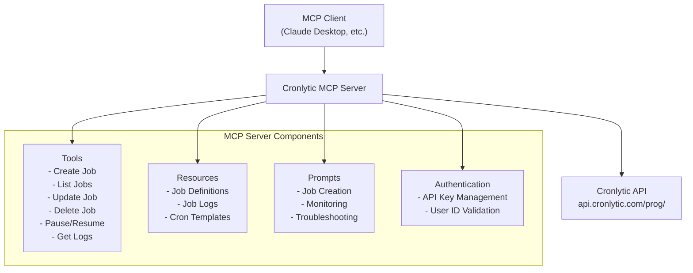

# Cronlytic MCP Server Implementation Plan

## Overview

This document outlines the comprehensive plan for building a Model Context Protocol (MCP) server that integrates with the Cronlytic API. The server will provide tools, resources, and prompts to enable seamless cron job management through LLM applications like Claude Desktop.

## Architecture Diagram



## 1. Project Structure

```
cronlytic-mcp-server/
├── src/
│   ├── __init__.py
│   ├── server.py              # Main MCP server implementation
│   ├── cronlytic_client.py    # Cronlytic API client wrapper
│   ├── tools/                 # Tool implementations
│   │   ├── __init__.py
│   │   ├── job_management.py  # CRUD operations for jobs
│   │   ├── job_control.py     # Pause/resume/monitoring
│   │   └── validation.py      # Input validation utilities
│   ├── resources/             # Resource implementations
│   │   ├── __init__.py
│   │   ├── job_resources.py   # Job data as resources
│   │   └── templates.py       # Cron expression templates
│   ├── prompts/               # Prompt implementations
│   │   ├── __init__.py
│   │   ├── job_prompts.py     # Job-related prompts
│   │   └── monitoring_prompts.py
│   └── utils/
│       ├── __init__.py
│       ├── auth.py            # Authentication handling
│       ├── validation.py      # Schema validation
│       └── errors.py          # Custom error classes
├── tests/                     # Test files
├── requirements.txt
├── README.md
├── config/
│   └── example_config.json    # Example configuration
└── pyproject.toml
```

## 2. Tools Implementation

### Core CRUD Tools

#### 2.1 `create_job`
- **Purpose**: Create new cron jobs in Cronlytic
- **Input**: Job name, URL, method, headers, body, cron expression
- **Validation**: Name format, URL validity, cron expression syntax
- **Output**: Created job details with job_id

#### 2.2 `list_jobs`
- **Purpose**: List all user's cron jobs
- **Input**: Optional filtering parameters
- **Output**: Array of job objects with status information

#### 2.3 `get_job`
- **Purpose**: Get specific job details
- **Input**: Job ID
- **Output**: Complete job object with execution details

#### 2.4 `update_job`
- **Purpose**: Update existing job configuration
- **Input**: Job ID and complete job definition
- **Validation**: All fields required (complete replacement)
- **Output**: Updated job object

#### 2.5 `delete_job`
- **Purpose**: Delete job permanently
- **Input**: Job ID
- **Output**: Confirmation of deletion

### Job Control Tools

#### 2.6 `pause_job`
- **Purpose**: Pause job execution
- **Input**: Job ID
- **Output**: Job object with paused status

#### 2.7 `resume_job`
- **Purpose**: Resume paused job
- **Input**: Job ID
- **Output**: Job object with pending status and updated next_run_at

#### 2.8 `get_job_logs`
- **Purpose**: Retrieve execution logs
- **Input**: Job ID
- **Output**: Array of log entries (last 50)

### Utility Tools

#### 2.9 `health_check`
- **Purpose**: Test API connectivity
- **Input**: None
- **Output**: API status and connectivity information

#### 2.10 `validate_cron`
- **Purpose**: Validate cron expressions
- **Input**: Cron expression string
- **Output**: Validation result and next execution times

#### 2.11 `test_webhook`
- **Purpose**: Test webhook endpoints before creating jobs
- **Input**: URL, method, headers, body
- **Output**: Response status and basic connectivity info

## 3. Resources Implementation

### Dynamic Resources

#### 3.1 Job List Resource (`cronlytic://jobs`)
- **Purpose**: Live list of all user jobs
- **Format**: JSON array of job objects
- **Updates**: Real-time via resource subscriptions

#### 3.2 Individual Job Resources (`cronlytic://job/{job_id}`)
- **Purpose**: Specific job details and configuration
- **Format**: JSON job object
- **Updates**: On job modifications

#### 3.3 Job Logs Resources (`cronlytic://job/{job_id}/logs`)
- **Purpose**: Execution history and logs
- **Format**: JSON array of log entries
- **Updates**: After each job execution

#### 3.4 Cron Templates (`cronlytic://templates/cron`)
- **Purpose**: Common cron expression patterns
- **Format**: JSON object with templates and descriptions
- **Content**: Examples like daily, hourly, weekly patterns

## 4. Prompts Implementation

### Job Management Prompts

#### 4.1 `create_webhook_job`
- **Purpose**: Guide users through webhook job creation
- **Arguments**: target_service (optional), frequency (optional)
- **Output**: Step-by-step job creation prompt

#### 4.2 `schedule_task`
- **Purpose**: Help with general task scheduling
- **Arguments**: task_type, frequency_description
- **Output**: Cron expression suggestions and setup guidance

#### 4.3 `monitor_jobs`
- **Purpose**: Set up job monitoring and alerting
- **Arguments**: None
- **Output**: Monitoring best practices and setup instructions

#### 4.4 `troubleshoot_job`
- **Purpose**: Debug failed or problematic jobs
- **Arguments**: job_id (optional), error_type (optional)
- **Output**: Troubleshooting steps and common solutions

#### 4.5 `optimize_schedule`
- **Purpose**: Optimize cron schedules for better performance
- **Arguments**: current_jobs_count (optional)
- **Output**: Scheduling optimization recommendations

### API Integration Prompts

#### 4.6 `setup_api_monitoring`
- **Purpose**: Monitor API endpoints health
- **Arguments**: api_url, expected_response_code
- **Output**: API monitoring job configuration guidance

#### 4.7 `backup_scheduler`
- **Purpose**: Set up automated backup jobs
- **Arguments**: backup_type, frequency
- **Output**: Backup scheduling best practices

#### 4.8 `notification_system`
- **Purpose**: Create notification workflows
- **Arguments**: notification_type, recipients
- **Output**: Notification job setup instructions

## 5. Authentication & Configuration

### Configuration Management
- **API Key Storage**: Environment variables and config files
- **User ID Management**: Secure storage and validation
- **Runtime Validation**: Authentication check on server startup
- **Configuration Sources**:
  - Environment variables (`CRONLYTIC_API_KEY`, `CRONLYTIC_USER_ID`)
  - Config file (`~/.cronlytic/config.json`)
  - Runtime parameters

### Security Features
- **Input Sanitization**: All user inputs validated and sanitized
- **URL Validation**: Webhook URLs checked for validity and safety
- **Cron Expression Validation**: Syntax and safety checks
- **Rate Limiting Awareness**: Respect API rate limits
- **Error Information**: Sanitized error messages (no sensitive data exposure)

## 6. Error Handling & Validation

### Input Validation Rules

#### Job Name Validation
- **Pattern**: `^[a-zA-Z0-9_-]+$`
- **Length**: 1-50 characters
- **Invalid Examples**: Spaces, special characters, empty strings

#### URL Validation
- **Format**: Valid HTTP/HTTPS URLs only
- **Security**: No local/private network URLs in production
- **Examples**: `https://api.example.com/webhook`

#### Cron Expression Validation
- **Format**: 5-field cron expressions
- **Pattern**: `^[0-9*,/-]+ [0-9*,/-]+ [0-9*,/-]+ [0-9*,/-]+ [0-9*,/-]+$`
- **Validation**: Logical validation (e.g., valid day/month combinations)

#### HTTP Method Validation
- **Allowed**: GET, POST, PUT, DELETE, PATCH, HEAD, OPTIONS
- **Default**: GET
- **Case**: Uppercase normalization

### Error Categories

#### Authentication Errors (401)
- **Cause**: Invalid API key or User ID
- **Response**: Clear authentication guidance
- **Action**: Prompt for credential verification

#### Authorization Errors (403)
- **Cause**: Job limit exceeded for plan
- **Response**: Plan upgrade suggestion with current limits
- **Details**: Current job count and plan limits

#### Validation Errors (422)
- **Cause**: Invalid input parameters
- **Response**: Specific field validation errors
- **Format**: Detailed field-by-field error messages

#### Not Found Errors (404)
- **Cause**: Job ID doesn't exist or access denied
- **Response**: Job existence verification
- **Suggestion**: List available jobs

#### API Connectivity Issues
- **Cause**: Network or service problems
- **Response**: Retry suggestions and status information
- **Fallback**: Cached data when appropriate

## 7. Implementation Details

### Key Features

#### Async Implementation
- **All Operations**: Use async/await for non-blocking I/O
- **Connection Pooling**: Reuse HTTP connections
- **Concurrent Operations**: Handle multiple requests efficiently

#### Comprehensive Logging
- **Debug Logging**: Detailed operation tracking
- **Operational Logging**: Key events and errors
- **Security Logging**: Authentication and authorization events
- **Performance Logging**: Request timing and performance metrics

#### Caching Strategy
- **Job Lists**: Cache with TTL for performance
- **Job Details**: Cache individual job data
- **Templates**: Cache cron templates and validation rules
- **Invalidation**: Smart cache invalidation on updates

#### Retry Logic
- **Exponential Backoff**: For temporary API failures
- **Circuit Breaker**: Prevent cascading failures
- **Timeout Handling**: Appropriate timeouts for operations
- **User Feedback**: Progress indication for long operations

#### Schema Validation
- **JSON Schema**: Comprehensive input validation
- **Runtime Validation**: Server-side validation of all inputs
- **Error Reporting**: Detailed validation error messages

### Tool Schema Example

```json
{
  "name": "create_job",
  "description": "Create a new cron job in Cronlytic",
  "inputSchema": {
    "type": "object",
    "properties": {
      "name": {
        "type": "string",
        "pattern": "^[a-zA-Z0-9_-]+$",
        "minLength": 1,
        "maxLength": 50,
        "description": "Job name (alphanumeric, hyphens, underscores only)"
      },
      "url": {
        "type": "string",
        "format": "uri",
        "description": "Webhook URL to call"
      },
      "method": {
        "type": "string",
        "enum": ["GET", "POST", "PUT", "DELETE", "PATCH", "HEAD", "OPTIONS"],
        "default": "GET",
        "description": "HTTP method"
      },
      "headers": {
        "type": "object",
        "description": "HTTP headers (optional)",
        "additionalProperties": {
          "type": "string"
        }
      },
      "body": {
        "type": "string",
        "description": "Request body (optional)",
        "default": ""
      },
      "cron_expression": {
        "type": "string",
        "pattern": "^[0-9*,/-]+ [0-9*,/-]+ [0-9*,/-]+ [0-9*,/-]+ [0-9*,/-]+$",
        "description": "5-field cron expression (minute hour day month day-of-week)"
      }
    },
    "required": ["name", "url", "cron_expression"]
  }
}
```

## 8. Development Phases

### Phase 1: Core Infrastructure
**Duration**: 2-3 days
**Deliverables**:
- Project structure setup
- Cronlytic API client wrapper
- Basic authentication and configuration
- Health check tool
- MCP server initialization

**Key Tasks**:
- Set up development environment
- Implement HTTP client with proper error handling
- Create configuration management system
- Implement basic MCP server structure
- Add logging infrastructure

### Phase 2: Basic CRUD Operations
**Duration**: 3-4 days
**Deliverables**:
- create_job, list_jobs, get_job tools
- Basic input validation
- Error handling framework
- Unit tests for core functionality

**Key Tasks**:
- Implement job creation with full validation
- Add job listing with proper formatting
- Create job retrieval functionality
- Comprehensive input validation
- Error handling and user feedback

### Phase 3: Advanced Job Management
**Duration**: 2-3 days
**Deliverables**:
- update_job, delete_job tools
- pause_job, resume_job functionality
- get_job_logs implementation
- Enhanced error handling

**Key Tasks**:
- Job update with validation
- Safe job deletion
- Job lifecycle management (pause/resume)
- Log retrieval and formatting
- Advanced error scenarios

### Phase 4: Resources Implementation
**Duration**: 2-3 days
**Deliverables**:
- Dynamic job resources
- Cron template resources
- Resource subscriptions
- Real-time updates

**Key Tasks**:
- Implement job list resources
- Create individual job resources
- Add cron template library
- Resource subscription mechanism
- Update notifications

### Phase 5: Prompts & UX
**Duration**: 3-4 days
**Deliverables**:
- All planned prompts
- Interactive job creation flows
- Monitoring and troubleshooting guidance
- User experience optimization

**Key Tasks**:
- Create job management prompts
- Develop API integration prompts
- Add troubleshooting assistance
- User workflow optimization
- Prompt testing and refinement

### Phase 6: Testing & Documentation
**Duration**: 2-3 days
**Deliverables**:
- Comprehensive test suite
- Performance optimization
- Complete documentation
- Claude Desktop integration guide

**Key Tasks**:
- Unit and integration testing
- Performance profiling and optimization
- Documentation writing
- Example workflows
- Deployment guides

## 9. Testing Strategy

### Unit Tests
**Coverage**: Individual functions and methods
**Focus Areas**:
- API client functionality
- Input validation logic
- Tool implementations
- Error handling paths
- Authentication mechanisms

**Tools**: pytest, pytest-asyncio, unittest.mock

### Integration Tests
**Coverage**: End-to-end workflows
**Focus Areas**:
- Complete API call chains
- MCP protocol compliance
- Authentication flows
- Error propagation
- Resource updates

**Environment**: Test API keys and isolated test environment

### Manual Testing
**Coverage**: User experience and edge cases
**Focus Areas**:
- MCP Inspector testing
- Claude Desktop integration
- Real-world workflow scenarios
- Performance under load
- Error recovery

**Tools**: MCP Inspector, manual test scripts

### Performance Testing
**Coverage**: Load and stress testing
**Focus Areas**:
- API rate limiting
- Concurrent request handling
- Memory usage
- Cache effectiveness
- Response times

## 10. Documentation & Examples

### User Documentation

#### Installation and Setup Guide
- **Prerequisites**: Python version, dependencies
- **Installation**: pip install, configuration
- **Authentication**: API key setup process
- **Claude Desktop Integration**: Configuration examples

#### Configuration Examples
- **Environment Variables**: Setup instructions
- **Config Files**: JSON configuration format
- **Multiple Environments**: Dev/staging/production setup

#### Common Use Cases and Workflows
- **API Monitoring**: Set up endpoint health checks
- **Backup Automation**: Schedule database backups
- **Notification Systems**: Create alert workflows
- **Data Processing**: Schedule ETL jobs

#### Troubleshooting Guide
- **Connection Issues**: Authentication problems
- **Job Failures**: Common failure causes
- **Performance Issues**: Optimization tips
- **Error Messages**: Detailed error explanations

### Developer Documentation

#### API Reference
- **Tool Specifications**: Complete schema documentation
- **Resource Formats**: Resource structure and updates
- **Prompt Templates**: Available prompts and usage
- **Error Codes**: Comprehensive error reference

#### Extension Points
- **Custom Tools**: Adding new functionality
- **Resource Types**: Creating custom resources
- **Prompt Development**: Writing effective prompts
- **Plugin Architecture**: Extensibility patterns

#### Contributing Guidelines
- **Code Style**: Formatting and conventions
- **Testing Requirements**: Test coverage expectations
- **Pull Request Process**: Contribution workflow
- **Release Process**: Version management

## 11. Success Metrics

### Functional Metrics
- **API Coverage**: 100% of Cronlytic API endpoints supported
- **Error Handling**: Graceful handling of all error scenarios
- **Validation**: Comprehensive input validation
- **Performance**: Sub-second response times for most operations

### User Experience Metrics
- **Ease of Use**: Intuitive prompts and clear documentation
- **Error Recovery**: Helpful error messages and recovery guidance
- **Workflow Efficiency**: Streamlined common use cases
- **Integration**: Seamless Claude Desktop integration

### Technical Metrics
- **Test Coverage**: >90% code coverage
- **Documentation**: Complete API and user documentation
- **Security**: No security vulnerabilities
- **Reliability**: Robust error handling and retry logic

## 12. Future Enhancements

### Potential Extensions
- **Bulk Operations**: Manage multiple jobs simultaneously
- **Job Templates**: Predefined job configurations
- **Monitoring Dashboards**: Visual job status monitoring
- **Webhook Testing**: Advanced webhook validation
- **Schedule Optimization**: AI-powered schedule recommendations

### Integration Opportunities
- **CI/CD Integration**: GitHub Actions, Jenkins plugins
- **Monitoring Tools**: Grafana, Datadog integration
- **Notification Services**: Slack, Discord, email integration
- **Database Connectors**: Direct database operation scheduling

---

## Next Steps

This comprehensive plan provides a roadmap for building a robust, user-friendly Cronlytic MCP server. The phased approach ensures steady progress while maintaining quality and testing standards.

**Immediate Action**: Begin with Phase 1 (Core Infrastructure) to establish the foundation for all subsequent development phases.

**Success Criteria**: Each phase should be completed with full testing and documentation before proceeding to the next phase.